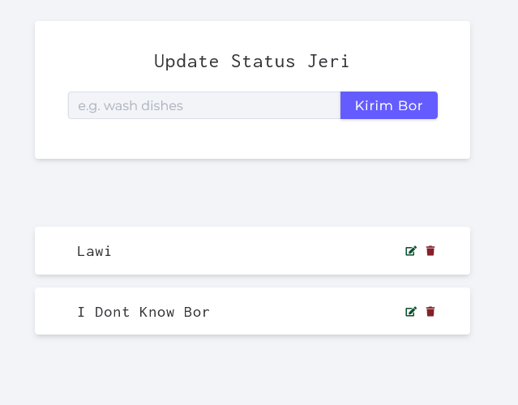
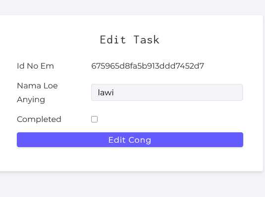
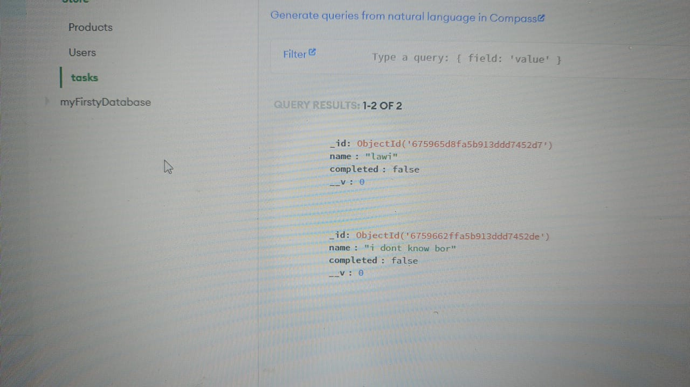
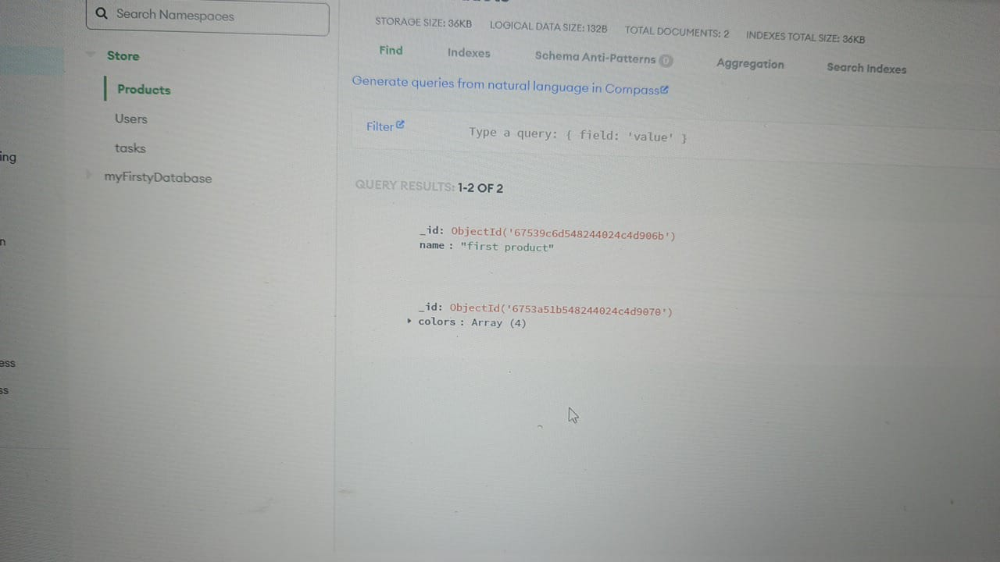

# aplikasih sederhana CRUD USING NODEJS,JS DOM,DATABASE MONGODB ATLAS.

Deskripsi singkat mengenai proyek ini dan tujuan yang ingin dicapai. Jelaskan bagaimana proyek ini dapat digunakan, siapa yang akan diuntungkan, dan lainnya.

## Daftar Isi

1. [Instalasi](#instalasi)
2. [Fitur](#fitur)
3. [Gambar](#gambar)
4. [Lisensi](#lisensi)

## Instalasi

Ikuti langkah-langkah berikut untuk menginstal dan menjalankan proyek ini di komputer lokal Anda:

1. **Clone repositori ini**:
   - Copy link ini: [https://github.com/jeripatut/projectulang.git](https://github.com/jeripatut/projectulang.git)
   - Paste link ini di CMD atau terminal Anda:
     ```bash
     https://github.com/jeripatut/projectulang
     ```
   - Kemudian jalankan perintah berikut untuk melakukan clone repositori:
     ```bash
     git clone https://github.com/jeripatut/projectulang.git
     ```

## Fitur

Fitur yang tersedia dalam aplikasi ini adalah sebagai berikut:
- **Update**: Untuk memperbarui data yang ada.
- **Edit**: Untuk melakukan perubahan data yang sudah ada.
- **Delete**: Untuk menghapus data.
- **Posting Data**: Untuk menambahkan data baru ke sistem.

Berikut adalah gambaran bentuk aplikasi ini.

## Gambar

### 1. Untuk Post Data



### 2. Untuk Edit Data



## Lisensi

Proyek ini dilisensikan di bawah **MIT License**. Lihat file [LICENSE](./license.txt) untuk detail lebih lanjut.
## UNTUK MEMBUAT DATABASENYA DIMONGODB ATLAS SILAKAN GUNAKAN SEPERTI GAMBAR DIBAWWAH INI



cara koneksinya selebih silakan cari diyoutube,karena di folder db/connect.js saya belum tempatkan link dari database mongodb atlasnya,,
semogha membantu....